# 0. Simple Web Stack

This document explains a basic one-server infrastructure to host a website at **www.foobar.com**, as part of the web infrastructure design project.

---

## 🔧 Infrastructure Diagram

```mermaid
graph TD
    User[User]
    DNS[DNS: www.foobar.com → 8.8.8.8]
    Server[Server @ 8.8.8.8]
    Nginx[Nginx Web Server]
    App[Application Server]
    Code[Application Codebase]
    DB[MySQL Database]

    User --> DNS --> Server
    Server --> Nginx --> App --> Code
    App --> DB
```

---

## 🌐 Explanation

### What is a server?
A **server** is a computer or virtual machine that provides services, data, or resources to other computers, known as clients.

### What is the role of the domain name?
The **domain name** (e.g., `foobar.com`) allows humans to access websites using readable names instead of IP addresses.

### What type of DNS record is `www` in `www.foobar.com`?
It is an **A record** that maps `www.foobar.com` to the IP address `8.8.8.8`.

### What is the role of the web server?
The **web server (Nginx)** listens for HTTP(S) requests from users and serves static content or forwards requests to the application server.

### What is the role of the application server?
The **application server** runs dynamic backend logic (e.g., using Python/Flask, Node.js, etc.) to generate responses for dynamic content.

### What is the role of the database?
The **MySQL database** stores structured data for the application to read, write, and update.

### How does the server communicate with the user’s computer?
The communication uses the **HTTP or HTTPS protocols over TCP/IP**.

---

## 🚨 Infrastructure Limitations

### Single Point of Failure (SPOF)
If the one server fails, the entire website becomes unavailable.

### Downtime During Maintenance
Updating the app or restarting Nginx means the site will be temporarily inaccessible.

### No Scalability
This setup cannot handle high traffic loads and lacks load balancing or redundancy.

*This architecture is typical for small applications or proof-of-concept projects, but lacks fault tolerance and scalability for production use.*
