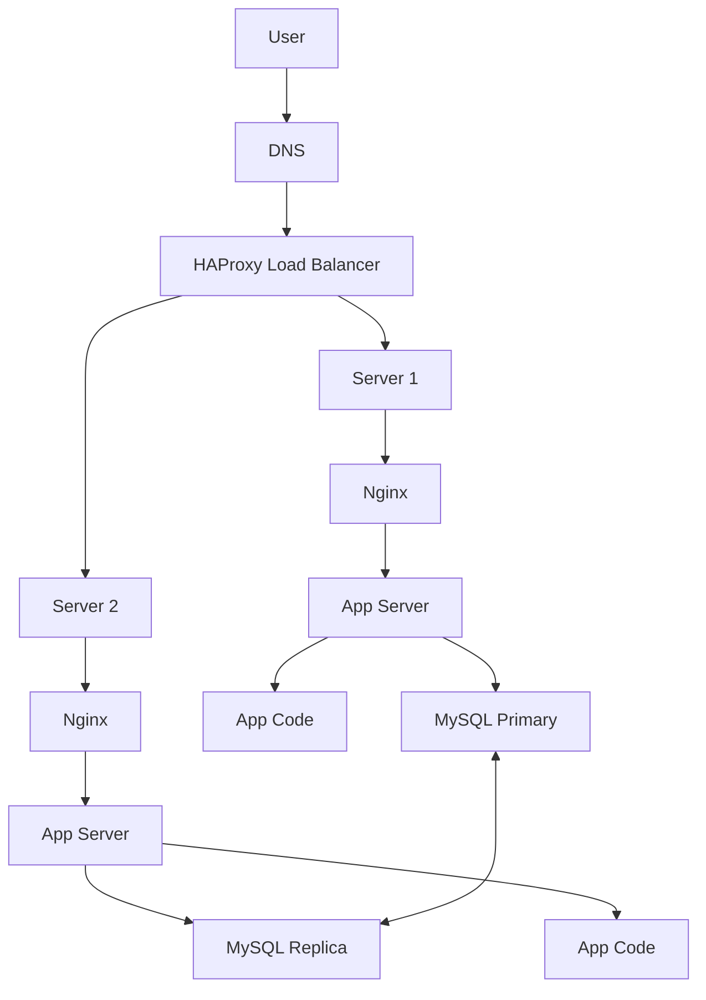

# 1. Distributed Web Infrastructure

This document illustrates a more fault-tolerant and scalable infrastructure for hosting `www.foobar.com`.

---

## 🔧 Diagram

---

## 💡 Explanation

### Why Add These Components?
- **HAProxy Load Balancer**: Distributes traffic to avoid overloading.
- **Two Servers**: High availability and redundancy.
- **Primary-Replica DB**: Improves read performance and fault tolerance.

### Load Balancer Algorithm
**Round Robin**: Alternates requests between servers.

### Active-Active vs Active-Passive
This setup is **Active-Active**, both servers serve traffic simultaneously.

### DB Replication
- **Primary**: Handles read and write.
- **Replica**: Read-only, replicates from primary.

---

## 🚨 Issues

- **SPOF**: Single Load Balancer
- **Security**: No firewall or HTTPS
- **No Monitoring**: No logs, alerts or performance metrics