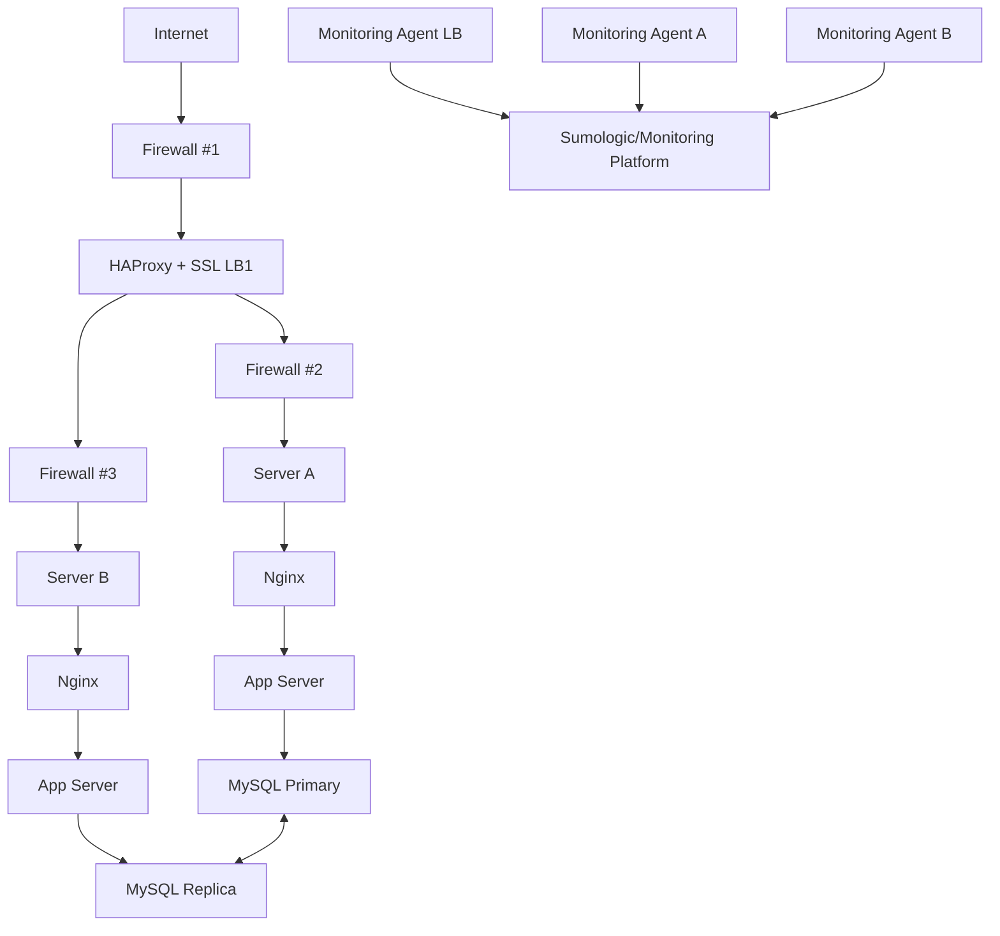

# 2. Secured and Monitored Web Infrastructure

This setup secures and monitors the web infrastructure for `www.foobar.com`.

---

## 🔐 Diagram

---

## 🔍 Explanation

### Why Add These Components?

- **Firewalls**: Control traffic, protect against attacks.
- **HTTPS (SSL)**: Encrypts data to ensure security.
- **Monitoring Agents**: Track metrics and logs for health checks.

### Monitoring
- Uses agents (e.g., Sumologic) to send logs and metrics.
- For QPS monitoring: track HTTP logs or use tools like Prometheus.

---

## 🚨 Issues

- **SSL Termination at LB**: Internal traffic is unencrypted.
- **Single MySQL Writer**: Fails if primary goes down.
- **All-in-One Servers**: Risk of interdependent failures.
